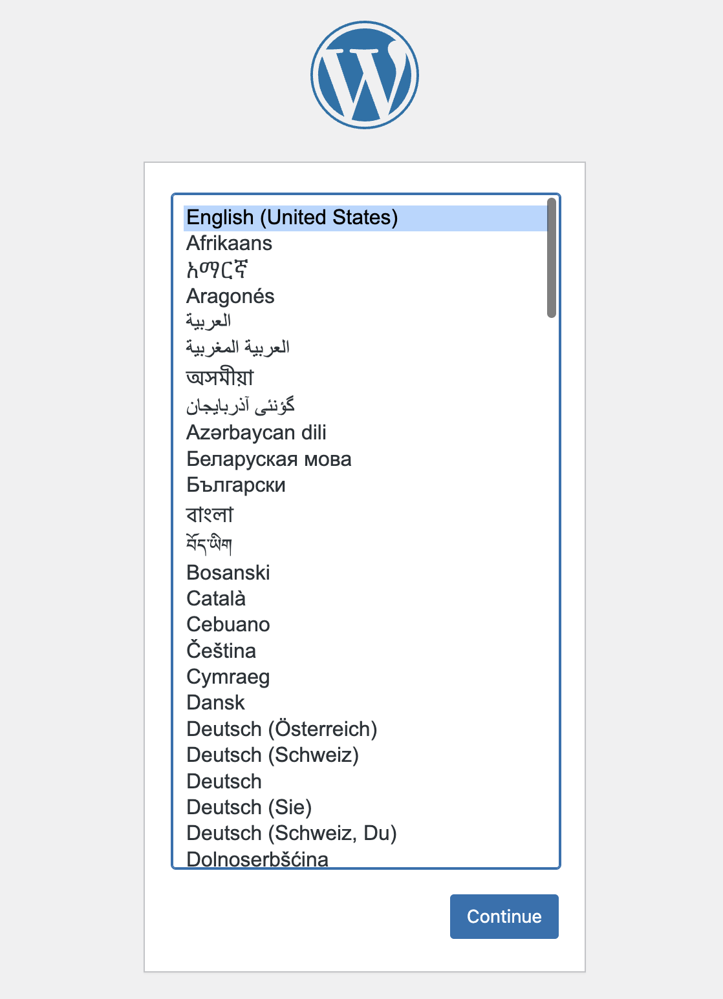

# Rocky Linux 9 LAMP WordPress (PHP 8.3) - Usage Instructions

## What this AMI includes
- OS: Rocky Linux 9.x
- Apache httpd, PHP-FPM (PHP 8.3), MariaDB (10.11)
- WordPress installed at: /var/www/wordpress
- phpMyAdmin installed (local-only)

## Quickstart (5 minutes)
1) Launch EC2
   - For WordPress (public): allow 80/443 from your IP (or 0.0.0.0/0 only if you intentionally want it public)
   - For phpMyAdmin: do not expose it publicly; use SSH tunnel or restrict access to your IP only

2) Access
   - http://<public-ip>/  (redirects to setup if not configured)
   - https://<public-ip>/ (self-signed by default; browser warning is expected)



3) Credentials
   - Credentials file (root-only): /etc/vividlytec/credentials.toml
   - View: sudo cat /etc/vividlytec/credentials.toml
   - Created on first boot

```
$ sudo cat /etc/vividlytec/credentials.toml
generated_at = "2026-02-05T00:10:45Z"
status = "success"

[wordpress]
path = "/var/www/wordpress"

[db]
name = "wordpress"
user = "wordpress"
password = "xxxxxxxxxxxxxxxxxxxxxxxx"
```

## Database (MariaDB)
- Application DB user (for WordPress/phpMyAdmin):
  - mysql -u wordpress -p
  - Password is in: sudo cat /etc/vividlytec/credentials.toml
- Admin access (root uses unix_socket):
  - sudo mysql

## phpMyAdmin access (recommended: SSH tunnel)
- Do not expose phpMyAdmin publicly.
- SSH tunnel:
  - ssh -L 8080:localhost:80 rocky@<public-ip>
  - Open: http://127.0.0.1:8080/phpmyadmin/
- Login: Use the WordPress DB user/password from /etc/vividlytec/credentials.toml (sudo required)

## HTTPS / Certificates
- Default: self-signed (browser warning is expected)
- Recommended (production): terminate TLS at an ALB with an ACM certificate.
- Alternative: install and configure your preferred certificate tool and replace the certificate files below:
  - /etc/pki/tls/certs/localhost.crt
  - /etc/pki/tls/private/localhost.key

## SELinux notes
- SELinux is enabled (Enforcing). This AMI is pre-configured for WordPress.
- If you move WordPress paths, update SELinux contexts accordingly.

## WP-CLI (URL update after stop/start)
If the instance public IP (or domain) changes, update the WordPress URL:

- Get current URL:
  - sudo -u apache wp --path=/var/www/wordpress option get home
  - sudo -u apache wp --path=/var/www/wordpress option get siteurl

- Update to a new URL (example with public IP):
  - NEW_URL="http://<new-public-ip>"
  - sudo -u apache wp --path=/var/www/wordpress option update home "$NEW_URL"
  - sudo -u apache wp --path=/var/www/wordpress option update siteurl "$NEW_URL"

(Optional) Replace old URLs in content (use carefully):
  - OLD_URL="http://<old-public-ip>"
  - sudo -u apache wp --path=/var/www/wordpress search-replace "$OLD_URL" "$NEW_URL" --all-tables --skip-columns=guid

