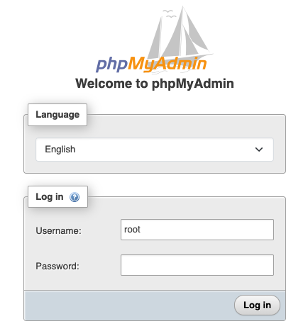

# LAMP Base on Ubuntu 24.04 (with phpMyAdmin)

A minimal LAMP base image for **Ubuntu 24.04**, intended as a starting point for customer-managed deployments.
Applications (WordPress, frameworks, CMS, etc.) are installed and maintained by the customer.

## Included software

- Apache 2.4
- MariaDB Server 10.11
- PHP 8.4 (Ondřej Surý PPA: `ppa:ondrej/php`)
- phpMyAdmin 5.2 (**localhost-only**)
- Certbot 5.3 (installed; HTTPS is enabled by the customer)

## Versions

> Versions may change if you upgrade packages after launch.  
> Verify the current versions on your instance using the commands below.

| Component   | Verify command |
|------------|----------------|
| Ubuntu      | `cat /etc/os-release` |
| Apache      | `apache2 -v` |
| MariaDB     | `mariadb --version` |
| PHP         | `php -v` |
| phpMyAdmin  | `dpkg -s phpmyadmin` | grep '^Version:'` |
| Certbot     | `certbot --version` |

### Copy/paste (collect versions)

```bash
cat /etc/os-release | grep PRETTY_NAME
apache2 -v | head -n1
mariadb --version
php -v | head -n1
dpkg -s phpmyadmin | grep '^Version:'
certbot --version
```

## Quick start

### 1) Connect to the instance

```bash
ssh -i <ssh-key-file.pem> ubuntu@<EC2-Public-IP>
```

### 2) Verify Apache (HTTP)

Open:

* `http://<EC2-Public-IP>/`

### 3) Use phpMyAdmin (localhost-only)

For security, **phpMyAdmin is restricted to localhost** by default.

Access it via SSH tunneling:

```bash
ssh -i <ssh-key-file.pem> -N -L 8080:localhost:80 ubuntu@<EC2-Public-IP>
```

Then open:

* `http://localhost:8080/phpmyadmin/`



> Do not expose phpMyAdmin publicly. Keep it local-only and access it through SSH tunneling.

### 4) Credentials

A credentials file is generated on first boot:

- `/home/ubuntu/credentials.toml`

View it:

```bash
cat /home/ubuntu/credentials.toml
```

> Treat this file as sensitive. Do not share it.

## PHP extensions (important)

This AMI installs PHP from `ppa:ondrej/php`.
When installing additional PHP extensions, **always use versioned packages**:

- ✅ `php8.4-curl`, `php8.4-xml`, `php8.4-mbstring`, ...
- ❌ Avoid unversioned meta packages like `php-curl`, `php-xml` (they may pull a different PHP version)

Example:

```bash
sudo apt-get update
sudo apt-get install -y php8.4-curl php8.4-xml php8.4-mbstring
```

## Enable HTTPS (customer responsibility)

Certbot is installed, but **not executed automatically**.

After DNS is ready, run:

```bash
sudo certbot --apache -d example.com -d www.example.com
```

Test renewal:

```bash
sudo certbot renew --dry-run
```

## Web root and permissions

Default web root:

* `/var/www/html`

This image uses a safe default ownership for the web root.
If your application requires write access (e.g., WordPress), update permissions as appropriate for your deployment.

Example baseline:

```bash
sudo chown -R www-data:www-data /var/www/html
sudo find /var/www/html -type d -exec chmod 2755 {} \;
sudo find /var/www/html -type f -exec chmod 0644 {} \;
```

## .htaccess / mod_rewrite (optional)

`mod_rewrite` is enabled.
If your application requires `.htaccess` (e.g., WordPress permalinks), enable `AllowOverride` for the web root:

```bash
sudo tee /etc/apache2/conf-available/override-webroot.conf >/dev/null <<'EOF'
<Directory /var/www/html>
    AllowOverride All
</Directory>
EOF

sudo a2enconf override-webroot
sudo systemctl reload apache2
```

## Security recommendations

* Restrict inbound access using Security Groups:

  * Allow **22/tcp** only from trusted IPs
  * Allow **80/tcp** as needed
  * Allow **443/tcp** only after HTTPS is configured
* Keep phpMyAdmin **localhost-only** and access via SSH tunnel.
* Apply OS and package updates regularly (customer responsibility).

## Support / responsibility boundary

This image provides a base LAMP environment.
All application installation, configuration, updates, and security hardening beyond the base stack are the customer’s responsibility.
